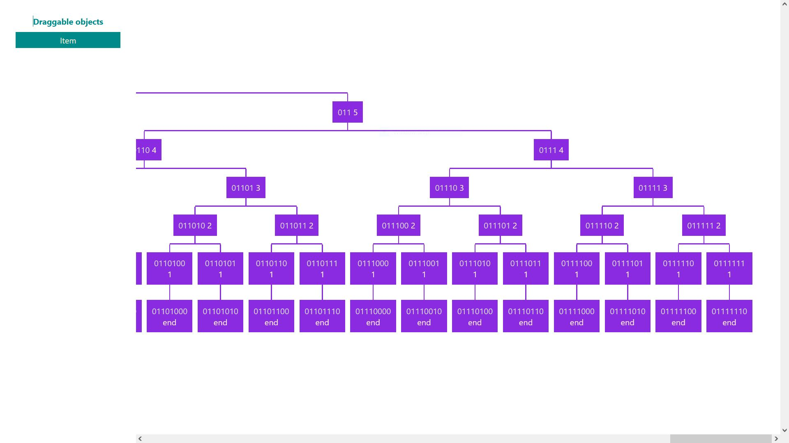
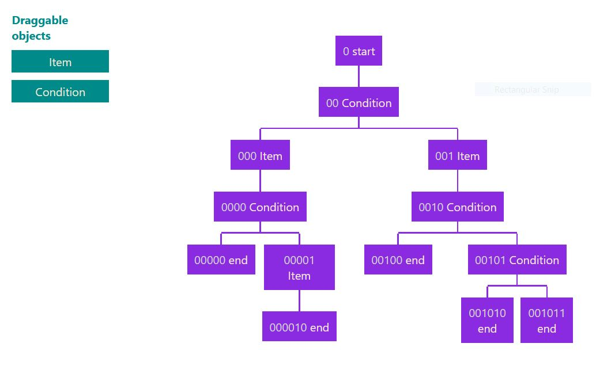

# React: drag and drop flow chart editor

###### _An intresting design challenge._

#

A Tree based flowchart with only condition and sequential flows

-   `Tree based UI`
-   `Drag and drop elements from a side shelf`
-   `Built using React hooks with typescript and scss`
-   `Custom logic, not dependent on 3rd party packages for flowcart`

#

## Tech and Dependencies

#

A react app that needs node to run

-   [Node 14.15](https://nodejs.org/en/)
-   [React 17](https://reactjs.org/)
-   [Typescript](https://www.typescriptlang.org/)
-   [Sass](https://sass-lang.com/)

#

## Installation

Requires [Node 14.15](https://nodejs.org/en/) to run.

#

Install dependencies:

```sh
npm i
```

#

Run code on local server:

```sh
npm run start
```

Open [`http://localhost:3000`](http://localhost:3000) on browser.

#

## To Do

-   Add remove node logic - on clicking a node, open a modal, with edit enabled and delete node option
-   Beautify asthetics
-   Editable node content
-   On hover show placeholder for soon-to-be-dropped element

#

**Hope you like it! Star the repo if you do. :)**
